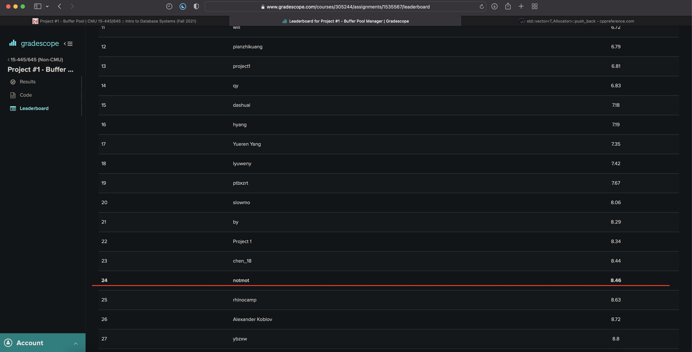

# My CMU15-445 Lab

## Project 1: [buffer bool manager][link1]
[link1]: https://15445.courses.cs.cmu.edu/fall2021/project1/

主要难点在于理解Pin/UnPin/Victim几个方法的含义, LRU就是一个map和一个双向链表和Leetcode那道题一样。接下来准备在学习本课程之余阅读 Effective Modern C++ && C++ Concurrency In Action, 学习现代Cpp的使用和Cpp的并发编程。

今天发现CMU也提供了对非CMU同学的代码评分测试，原来本地的测试仅是一个不完整的测试，不能反应代码的正确性。在第一次提交后，有非常多的测试无法通过，经过debug，发现并解决了以下两个问题:

1. 迭代器失效问题

这个问题非常愚蠢，问题代码如下:
```c++
auto iter = page_table_.find(page_id);
if (iter == page_table_.end()) {
return true;
}
if (pages_[iter->second].pin_count_ != 0) {
// someone is using the page
return false;
}
// Remove P from the page table, reset its metadata and return it to the free list.
free_list_.push_back(iter->second);
page_table_.erase(page_id);     // iter point to this entry
pages_[iter->second].is_dirty_ = false;
pages_[iter->second].page_id_ = INVALID_PAGE_ID;
memset(pages_[iter->second].GetData(), 0, PAGE_SIZE);
```
erase调用导致iter指向的RB_Tree对应节点被删除了，后面使用的iter指向的空间是未知的。这个问题带了的启示是迭代器指向的区域不是静态的，例如vector扩容等都会导致原先获取的迭代器失效，因此使用迭代器应该做到即用即取，不要使用指向数据空间可能发生过变化的迭代器。

2. 在Fetch Page时更新脏标记的问题

在FetchPgImp获取一个页时，如果该页已经在内存中，在返回给调用方前，我们必须主动将该页置为dirty，否则无法通过IsDirty测试。我认为这个要求主要是因为dirty标记为false时会导致跳过Flush到磁盘的操作，被Fetch的页其实不一定会被修改，用户到底修改没有其实取决于unpin时的is_dirty参数。那么我又产生了一个疑问点，如果一个页被多次Pin过，即相当于有多个线程同时持有过该页，那么如果一个线程A修改了这个页，A的is_dirty参数为true，另一个线程B没有修改该页，B的is——dirty则为false，如果A先于B unpin了该页, 那么在unpin逻辑处是否需要增加一个判断: 如果当前页目前状态为脏，即使unpin的is_dirty == false，也不修改该页的脏状态。显然增加这个逻辑会导致页表的脏位一直为true(因为Fetch的时候就必须置为脏)，后来我发现其实这个问题并没有那么复杂:

因为如果是B后unpin，那么理应B会覆盖A的页表，那么A的脏状态其实是没有意义的，只有最后一个unpin的线程，其修改才会被Flush到磁盘上，如果B线程一直没有修改一个页，那么的确刷盘的操作是可以跳过的，所以我们在unpin时无条件使用线程的is_dirty参数即可。

最终排名:



## Project 2: [extendible hash index][link2]
[link2]: https://15445.courses.cs.cmu.edu/fall2021/project2/

实现一个