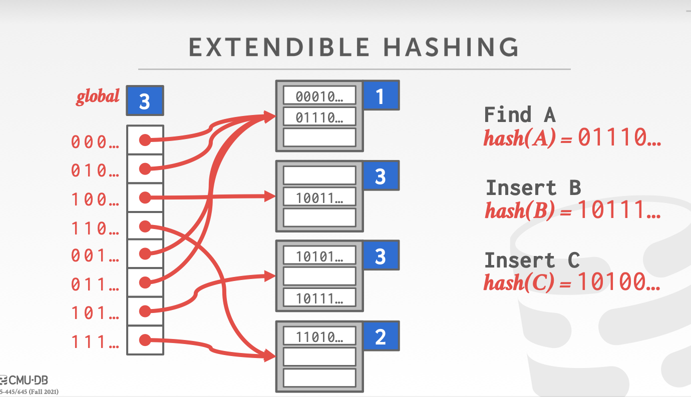
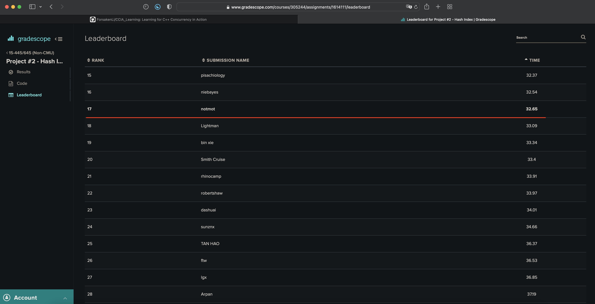

# My CMU15-445 Lab

## Project 1: [buffer bool manager][link1]
[link1]: https://15445.courses.cs.cmu.edu/fall2021/project1/

主要难点在于理解Pin/UnPin/Victim几个方法的含义, LRU就是一个map和一个双向链表和Leetcode那道题一样。接下来准备在学习本课程之余阅读 Effective Modern C++ && C++ Concurrency In Action, 学习现代Cpp的使用和Cpp的并发编程。

今天发现CMU也提供了对非CMU同学的代码评分测试，原来本地的测试仅是一个不完整的测试，不能反应代码的正确性。在第一次提交后，有非常多的测试无法通过，经过debug，发现并解决了以下两个问题:

1. 迭代器失效问题

这个问题非常愚蠢，问题代码如下:
```c++
auto iter = page_table_.find(page_id);
if (iter == page_table_.end()) {
return true;
}
if (pages_[iter->second].pin_count_ != 0) {
// someone is using the page
return false;
}
// Remove P from the page table, reset its metadata and return it to the free list.
free_list_.push_back(iter->second);
page_table_.erase(page_id);     // iter point to this entry
pages_[iter->second].is_dirty_ = false;
pages_[iter->second].page_id_ = INVALID_PAGE_ID;
memset(pages_[iter->second].GetData(), 0, PAGE_SIZE);
```
erase调用导致iter指向的RB_Tree对应节点被删除了，后面使用的iter指向的空间是未知的。这个问题带了的启示是迭代器指向的区域不是静态的，例如vector扩容等都会导致原先获取的迭代器失效，因此使用迭代器应该做到即用即取，不要使用指向数据空间可能发生过变化的迭代器。

2. dirty位的更新问题

在一开始，我认为dirty位的更新逻辑应该是根据unpin返回时，根据用户给定的is_dirty是dirty就在pages_里保存为dirty=true，不是就保存dirty=false。后来我发现这种方式是错误的，因为假如后续一个用户读取一个在内存中的已经被标记为脏的页时，假如其没有对该页进行修改，那么其unpin这个页时的is_dirty参数为false，如果这个false覆盖了原先的is_dirty=true,
就会导致先前的修改丢失，所以需要加上一个判断, 仅有在unpin时回传的参数is_dirty为true时才进行覆盖。
``
最终排名:


## Project 2: [extendible hash index][link2]

[link2]: https://15445.courses.cs.cmu.edu/fall2021/project2/

### 理解extendible hash

和往年的实现B+树索引不同，今年Project 2变成了实现可拓展哈希索引，[golang的map][link3]本质上就是基于extendible hash与chained hashing设计的结合，golang的桶在溢出时会同时挂载在原bucket的overflow位和dictionary的overflow位，扩容逻辑和shrink逻辑相比extendible hash也更加复杂。不过根据golang的设计可以帮助我们更快的理解extendible hash。

[link3]: https://www.qcrao.com/2019/05/22/dive-into-go-map/

extendible hash可以通过桶的分裂或合并来适应数据库大小的变化，这样可以保持空间的使用效率。由于重组每次仅作用于一个桶，因此所带来的性能开销较低。

在使用extendible hash时，hash function h 将key映射为一个b位整数，一个典型的b值为32。

对于桶地址表（数组），有一个散列前缀 i (0<=i<=b)，一开始不使用散列值的所有位数，i 值随着数据库大小的变化而增大或者减少。

因为有共同散列前缀的几个表项可能指向同一个桶，因此每个桶也有一个前缀值 ij，表明确定该桶需要的散列值位数(depth)。

具体操作：

```
确定key对应桶的位置：取 h(key) 的前 i 个高位，这个数为数组offset，再从数组表项中得到指向桶 j 的指针。
插入：若该桶未满，直接插入；否则分裂该桶，将该桶中的entry重新分配：
若 i = ij：此时指向该桶的只有一个表项，需要将地址表大小扩大一倍，i+=1，原表中的每个表项都由两个表项取代，两个表项都含有和原始表项一样的指针。现在有两个表项指向 j，系统分配新桶 z，令第二个表项指向此新桶，令 ij 和 iz 都为 i，将桶 j 中的记录重新散列。分裂后再尝试插入，若插入不成功则继续分裂。若桶 j 中所有key一样，此时继续插入已无作用，需使用溢出桶方法。
若 i > ij，则系统不需要扩大一倍，直接分裂。
删除：确定好 key 对应的桶 j 后，把记录从桶中删除。若桶变空，则桶删除，此时有的桶可能需要合并，地址表大小需要减半。只有当桶数目减少很多时，减小桶地址表的大小才是值得的（改变表大小开销很大）。
```


### Project 实现

在本Project中，课程设计三部分需要实现的内容: dictionary_page, bucket_page和extendible_hash_table本身，以及通过dictionary和bucket的RWMutex实现的并发控制。

以下是几个实现中遇到的值得记录的问题:

1. 分裂的实现问题

extendible hash在扩容时采用的是分裂的方法, 即将原先前缀为xxx的桶分裂为编号为1xxx的桶和0xxx的桶，并将原先桶中的数据rehash到这两个前缀长度+1的桶中，并将dictionary中该桶先前的链接，这个过程的逻辑看似不复杂，但有以下两个问题在实现时需要考虑:

- 如果桶在分裂后，依旧有多个dictionary中的链接指向该桶的问题

这个问题是我在一开始没有考虑到的，如下图所示，第一个编号为"0"的桶有4个指向它的链接，这种情况的出现是由于数据的倾斜性，编号为"1"的桶因为数据更多已经发生了2次扩容并使全局深度变为了3，此时所有以0为低位的前缀在dictionary中都指向了第一个编号为0的桶。如果该桶要发生扩容时，则不能简单的仅将00和01指向分裂的两个桶，而是要将以00为前缀的dictionary中的所有标签指向这个分裂后的"00"，01同理。在下图这种情况下，我们需要重设001、000、011、010的指向。



- rehash后桶依旧full的问题

在SpiltInsert一开始我的设计是在分裂完成后，rehash时直接和旧数据一起将新的kv对插入，但分裂的之后桶其实有可能还是满的(比如0桶的值全部rehash到了01桶中，新的key再次插入01就会溢出)，再加入新的kv对时可能会溢出。还需要再次分裂，因此我们在实现时还需再次调用Insert，需要注意的是调用前需要释放持有的所有写锁，否则会导致deadlock。

2. 缩容的实现问题

在一开始，我以为缩容的逻辑是当两个编号差值为1(如001和000)的桶中kv对的数目之和小于一个桶的容量时，就进行合并。这种方式事实上实现复杂，且会导致整个hash表的性能出现抖动，如果对一个刚分裂的桶删除了一个entry，就会导致其立刻shrink，这种设计显然是不合理的。正确的逻辑应该是在Remove一个entry后检查，如果bucket为空就进行缩容，和其匹配的桶进行合并。

在Merge时，我们也不能简单的仅修改dictionary的链接，delete空的bucket_page就草草了事，同样需要注意以下几个问题:

- Merge的条件检查

发起Merge调用前，Remove会检查Merge的条件是否满足，但在Merge时，我们首先需要获取hash dictionary的写锁，通过查看写锁的代码可以观察到写锁在获取时需要等待所有读锁释放，并根据写者获取mutex的顺序来依次唤醒wait的写锁，因此我们不能确定在获取到写锁后，Merge的条件是否还满足。所以在获取到写锁后，还需要再次检查Merge的条件，如target_bucket是否还为空，target_bucket和合并目标的image_bucket的本地深度是否相同，满足后才能进行合并操作。

- 在Merge前已经有多个bucket指向target_bucket/image_bucket

这个问题和分裂的过程是一样的，如果合并的两个桶在先前已经有不止一个链接，那么我们在Merge时需要将他们统统链接到合并后的bucket。

最终排名:



## Project 3: [query execution][link3]

[link3]: https://15445.courses.cs.cmu.edu/fall2021/project3/

### 对象含义

ExecutorContext: 查询的上下文，所有和数据库相关的(Catalog)信息及Transaction、BufferBool等都可通过该对象交互。

Plan: 对于每一种Executor都有其对应类型的Plan Node，控制了该类型的Executor执行逻辑。

Catalog: 一个数据库维护一个Catalog，以跟踪关于数据库的元数据。与Catalog交互，以查询有关表、索引及其模式的信息。

TableInfo: Table的元数据，包括一个指向table的unique_ptr和属于该table的schema。

TableHeap: 提供了对于该table插入、查询和删除tuple的方法，table_heap仅存储了buffer_bool_manager的指针和存储该表的首个page_id，通过此来访问table。

// pending

